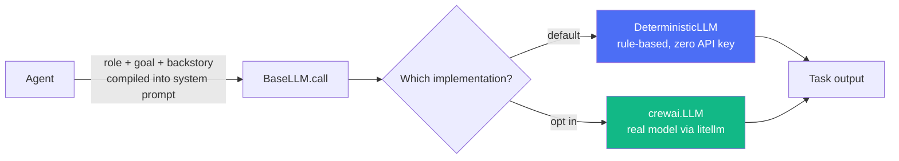
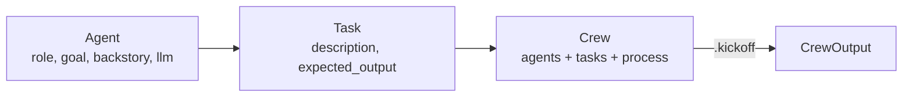
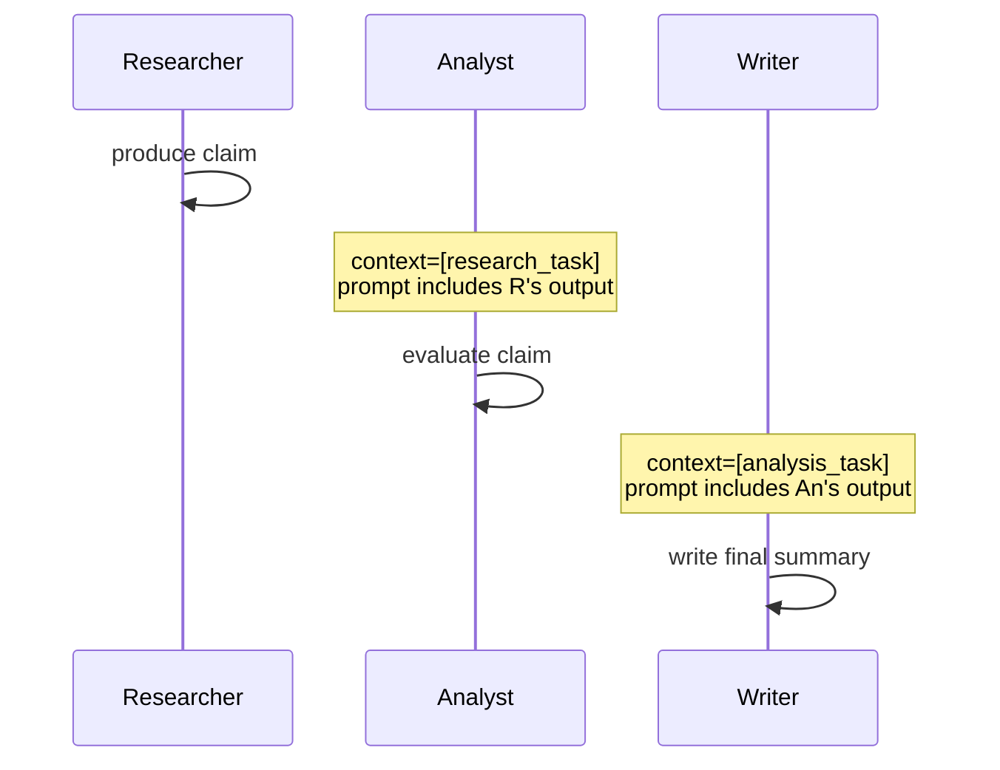
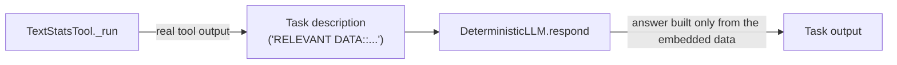
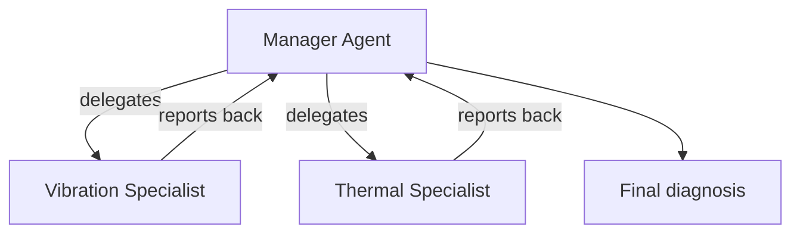
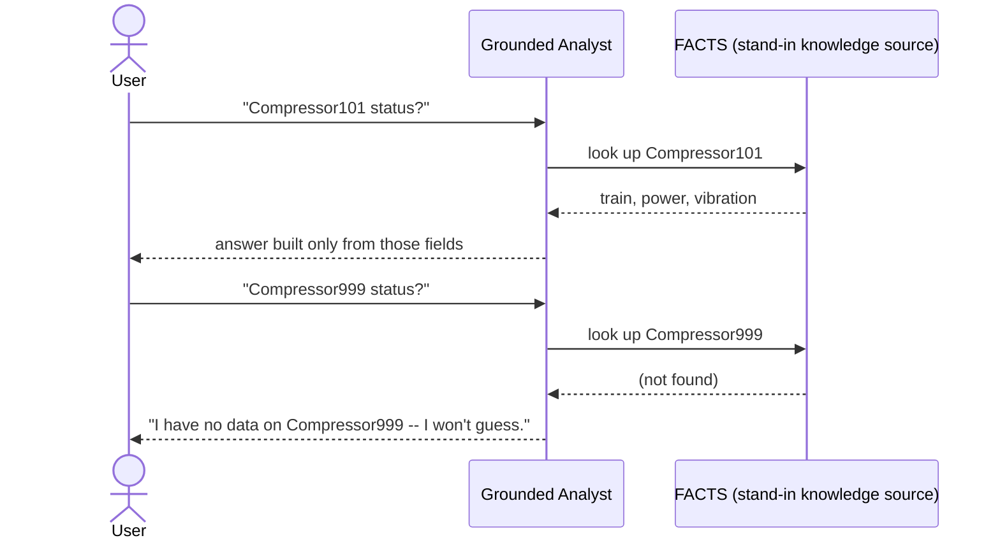

# CrewAI Multi-Agent Orchestration: A Practical Tutorial

A hands-on, code-first tour of [CrewAI](https://docs.crewai.com):
Agents, Tasks, Crews, the Sequential and Hierarchical processes, custom
Tools, and — the module everything else builds toward — **grounding an
agent's answers in real data instead of letting it guess**.

Every example runs with **zero API keys** against a small deterministic
stand-in model (`src/offline_llm.py`), and every module documents
exactly what changes to run it against a real LLM instead.

This is project 1 of a 2-part CrewAI mini-portfolio, itself part of a
larger semantics/ontology/agent-frameworks portfolio. See also:

- [`crewai-lng-maintenance-crew`](../crewai-lng-maintenance-crew) — a sequential crew grounded in an LNG plant knowledge graph
- [`crewai-manufacturing-quality-crew`](../crewai-manufacturing-quality-crew) — a crew grounded in a SOSA/SSN manufacturing digital twin, with sequential and hierarchical variants
- [`semantics-ontology-tutorial`](../semantics-ontology-tutorial) and its two applied siblings — the ontology/knowledge-graph side of this same portfolio, using LangGraph for orchestration instead of CrewAI

## Why offline-by-default

CrewAI drives every agent by calling an LLM. Rather than requiring a
paid API key just to read this tutorial, every module here runs
against `DeterministicLLM`, a small rule-based implementation of
CrewAI's own `BaseLLM` extension point — the exact same interface a
self-hosted or custom model would implement in production. Swapping it
for a real model (`offline_llm.real_llm()`, requires
`ANTHROPIC_API_KEY`) is a one-line change in every module; nothing
about the Agents/Tasks/Tools/Crews changes, because they only depend on
the `BaseLLM` interface, never on which implementation of it they're
given.



## Table of contents

1. [Agents, Tasks, and Crews](#01--agents-tasks-and-crews)
2. [Sequential process & context hand-off](#02--sequential-process--context-hand-off)
3. [Custom tools](#03--custom-tools)
4. [Hierarchical process](#04--hierarchical-process)
5. [Grounded agents (capstone)](#05--grounded-agents-capstone)
6. [Getting started](#getting-started)
7. [Project structure](#project-structure)

---

## 01 · Agents, Tasks, and Crews

The three building blocks. An `Agent`'s role/goal/backstory aren't
flavor text — they're compiled directly into the system prompt that
steers the model. A `Task` has a description and expected output, and
belongs to one agent. A `Crew` bundles agents + tasks + a `Process` and
is what you call `.kickoff()` on.



Run it: [`src/m1_agents_tasks_crews.py`](src/m1_agents_tasks_crews.py)

## 02 · Sequential process & context hand-off

`Process.sequential` runs tasks in list order. `Task(context=[other_task])`
is the mechanism multi-agent hand-off is built on: CrewAI automatically
appends the referenced task's output into the next agent's prompt.



Run it: [`src/m2_sequential_process.py`](src/m2_sequential_process.py)

## 03 · Custom tools

A `BaseTool` is a name, a description, and a `_run()` method — real
Python that executes when the model decides to call it. With a real
tool-calling model, CrewAI drives this through a live
`Thought / Action / Action Input / Observation` loop; the exact prompt
and transcript are captured verbatim in
[`docs/react_transcript_example.md`](docs/react_transcript_example.md).

The offline default in this repo uses a different, equally valid
pattern instead of emulating that live loop: **call the tool directly
in Python, then embed its result into the Task description** as the
data the agent must answer from. It's the same technique the two
applied repos use to ground a full knowledge-graph query at scale.



Run it: [`src/m3_custom_tools.py`](src/m3_custom_tools.py)

## 04 · Hierarchical process

`Process.hierarchical` gives a manager agent a pool of workers and
lets it decide, at runtime, who does what — via CrewAI's built-in
"Delegate work to coworker" tool, the same live Action/Action Input
loop as module 3, aimed at other agents. That's genuine judgment a
deterministic stand-in can't meaningfully fake, so this module builds
and validates a real hierarchical `Crew` but only calls `.kickoff()`
if a real LLM is available.



Run it: [`src/m4_hierarchical_process.py`](src/m4_hierarchical_process.py)
(add `ANTHROPIC_API_KEY` to see live delegation)

## 05 · Grounded agents (capstone)

The pattern everything else was building toward: an agent that answers
**only** from facts it was actually given, and says so plainly when a
question falls outside them.



In the two applied repos in this portfolio, `FACTS` is a real OWL/RDF
knowledge graph queried through a CrewAI tool — same contract, real
data, industrial scale.

Run it: [`src/m5_grounded_agent.py`](src/m5_grounded_agent.py)

---

## Getting started

### Prerequisites

- **Python 3.10, 3.11, or 3.12** (CrewAI's dependency chain — notably `tiktoken`'s compiled extension — does not yet have prebuilt wheels for 3.13+ on all platforms; 3.10 is what this repo was built and tested against)

### Setup

```bash
git clone <this-repo-url>
cd crewai-multi-agent-tutorial
python -m venv .venv
source .venv/bin/activate      # Windows: .venv\Scripts\activate
pip install -r requirements.txt
```

### Run everything

```bash
python run_all.py
```

### Run a single module

```bash
python src/m3_custom_tools.py
```

### Run the test suite

```bash
pytest -v
```

### Use a real LLM instead of the offline default

```bash
export ANTHROPIC_API_KEY=sk-...   # Windows: $env:ANTHROPIC_API_KEY="sk-..."
```

Then, in any module, swap `DeterministicLLM()` for
`offline_llm.real_llm()`. `m4_hierarchical_process.py` already checks
for the key automatically and uses it if present.

### Troubleshooting (Windows)

CrewAI's console output uses emoji in its bordered panels, which can
trip Windows' default `cp1252` terminal encoding. Every script in this
repo runs with `verbose=False` to avoid it entirely; if you flip
`verbose=True` to see the nicer panels, run with
`$env:PYTHONIOENCODING="utf-8"` (PowerShell) or
`PYTHONIOENCODING=utf-8` (bash) first.

## Project structure

```
crewai-multi-agent-tutorial/
├── src/
│   ├── offline_llm.py           # DeterministicLLM base class + real_llm() swap-in
│   ├── m1_agents_tasks_crews.py
│   ├── m2_sequential_process.py
│   ├── m3_custom_tools.py
│   ├── m4_hierarchical_process.py
│   └── m5_grounded_agent.py
├── docs/
│   └── react_transcript_example.md   # a real LLM's live tool-calling transcript, captured verbatim
├── tests/                       # pytest suite covering every module
├── run_all.py                   # runs all 5 modules in sequence
├── pytest.ini
└── requirements.txt
```

## Tech stack

| Concern              | Library     |
|-----------------------|-------------|
| Agent orchestration    | [CrewAI](https://docs.crewai.com) |
| Testing                | [pytest](https://docs.pytest.org/) |

## License

[MIT](LICENSE)
